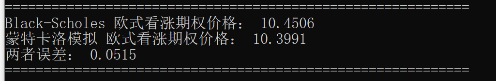
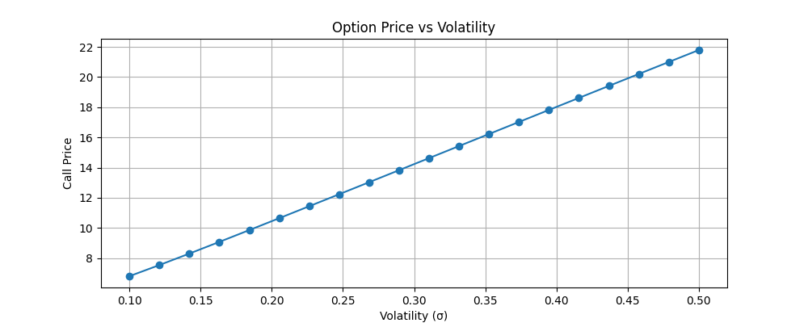

# 期权定价模型实现（Black-Scholes + 蒙特卡洛模拟）

本项目是《随机过程》与《随机分析》课程的延伸实践，旨在通过Python实现经典的金融期权定价方法，包括Black-Scholes解析解和蒙特卡洛数值模拟，并对两者结果进行对比分析。

## 项目背景
在金融工程中，期权定价是核心问题之一。Black-Scholes模型提供了欧式期权定价的解析解，而蒙特卡洛模拟则是一种灵活的数值方法，通过模拟标的资产价格路径来估计期权价值。本项目结合两种方法，加深对金融数学理论的理解。

## 技术栈
- Python 3.11
- NumPy：数值计算
- SciPy：统计函数
- Matplotlib：数据可视化

## 项目结构
- `option_pricing.py`：主程序文件
- `README.md`：项目说明文档

## 核心功能
1. **Black-Scholes 模型**：实现欧式看涨/看跌期权的定价，并计算希腊字母。
2. **蒙特卡洛模拟**：基于几何布朗运动模拟标的资产价格路径，估计期权价格。
3. **结果对比**：分析两种方法的定价误差。
4. **敏感性分析**：分析期权价格对波动率（σ）的敏感性。

## 运行结果
在参数 `S=100, K=100, T=1, r=0.05, σ=0.2` 下：
- Black-Scholes 价格：10.4506
- 蒙特卡洛模拟价格：10.3991
- 两者误差：0.0515

### 终端输出结果


### 波动率敏感性分析图


## 运行说明
```bash
# 安装依赖
pip install numpy scipy matplotlib -i https://pypi.tuna.tsinghua.edu.cn/simple

# 运行代码
python option_pricing.py
